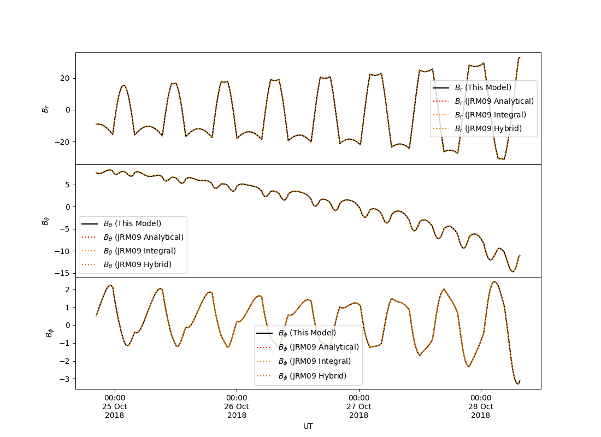

# con2020

Python implementation of the Connerney et al., 1981 and Connerney et al., 2020 Jovian magnetodisc model. This model provides the magnetic field due to a "washer-shaped" current near to Jupiter's magnetic equator. This model code uses either analytical equations from Edwards et al., 2001 or the numerical integration of the Connerney et al., 1981 equations to provide the magnetodisc field, depending upon proximity to the disc along _z_ and the inner edge of the disc, _r<sub>0</sub>_.

For the IDL implementation of this model, see:
https://github.com/marissav06/con2020_idl

Or for Matlab:
https://github.com/marissav06/con2020_matlab

A PDF documentation file is available here: [con2020_final_code_documentation_june9_2022.pdf][con2020_final_code_documentation_june9_2022 (10).pdf](https://github.com/gabbyprovan/con2020/files/8869078/con2020_final_code_documentation_june9_2022.10.pdf). It describes the Connerney current sheet model and general code development (equations used, numerical integration assumptions, accuracy testing, etc.). Details specific to the Python code are provided in this readme file.

These codes were developed by Fran Bagenal, Marty Brennan, Matt James, Gabby Provan, Marissa Vogt, and Rob Wilson, with thanks to Jack Connerney and Masafumi Imai. They are intended for use by the Juno science team and other members of the planetary magnetospheres community. Our contact information is in the documentation PDF file.

## Installation

Install the module using `pip3`:

```bash
pip3 install --user con2020

#or if you have previously installed using this method
pip3 install --upgrade --user con2020
```

Or using this repo:

```bash
#clone the repo
git clone https://github.com/gabbyprovan/con2020
cd con2020

#EITHER create a wheel and install (X.X.X is the current version number)
python3 setup.py bdist_wheel
pip3 install --user dist/con2020-X.X.X-py3-none-any.whl

#or directly install using setup.py
python3 setup.py insall --user
```

## Usage

To call the model, an object must be created first using `con2020.Model()`, where the default model parameters, model equations used or coordinate systems of input and output can be altered using keywords, e.g:

```python
import con2020

#initialize a model object with default parameters
def_model = con2020.Model()

#initialize a model which uses spherical polar coordinates for input and output
sph_model = con2020.Model(CartesianIn=False,CartesianOut=False)

#initialize a model with custom parameters (longhand)
cust_model0 = con2020.Model(mu_i_div2__current_density_nT=150.0,
                           	r0__inner_rj=9.5,
                           	d__cs_half_thickness_rj=3.1)

#equivalently, a custom parameter model (shorthand)
cust_model1 = con2020.Model(mu_i=150.0,r0=9.5,d=3.1)
```

Once a model object is initialized, the model field can be obtained by calling the member function `Field()` and supplying input coordinates as three scalars, or three arrays (all of which are in right-handed System III), e.g.:

```python
#Example 1: the model at a single Cartesian position (all in Rj)
x = 5.0
y = 10.0
z = 6.0
Bcart = def_model.Field(x,y,z)
Result:
Bxyz=[15.57977074, 36.88229249, 63.02051163] nT
Calculated using the default con2020 model keywords and the hybrid approximation.

#Example 2: the model at an array of positions of spherical polar coordinates
r = np.array([10.0,20.0])					#radial distance in Rj
theta = np.array([30.0,35.0])*np.pi/180.0	#colatitude in radians 
phi = np.array([90.0,95.0])*np.pi/180.0	#east longitude in radians
Bpol = sph_model.Field(r,theta,phi)
Result:
Spherical polar Brtp =[63.32354453 ,31.15790459], [-21.01051861 , -6.86773727], [-3.61151705, -2.72626057] nT
Cartesian       Bxyz =[3.61151705, 1.6486016], [13.4661294,  12.43672946], [65.34505753, 29.46223351] nT
Calculated using the default con2020 model keywords and the hybrid approximation.
```

The output will be a `numpy.ndarray` with a shape `(n,3)`, where `n` is the number of input coordinates, `B[:,0]` corresponds to either `Bx` or `Br`; `B[:,1]` corresponds to `By` or `Btheta`; and `B[:,2]` corresponds to either `Bz` or `Bphi`.  A full list of model keywords is shown below:

| Keyword (long)                            | Keyword (short) | Default Value | Description                                                  |
| ----------------------------------------- | --------------- | ------------- | ------------------------------------------------------------ |
| `mu_i_div2__current_density_nT`           | `mu_i`          | `139.6`*      | Current sheet current density in nT.                         |
| `i_rho__radial_current_density_nT`        | `i_rho`         | `16.7`*       | Radial current density in nT from Connerney et al 2020.      |
| `r0__inner_rj`                            | `r0`            | `7.8`         | Inner edge of the current sheet in R<sub>j</sub>.            |
| `r1__outer_rj`                            | `r1`            | `51.4`        | Outer edge of the current sheet in R<sub>j</sub>.            |
| `d__cs_half_thickness_rj`                 | `d`             | `3.6`         | Current sheet half thickness in R<sub>j</sub>.               |
| `xt__cs_tilt_degs`                        | `xt`            | `9.3`         | Tilt angle of the current sheet away from the SIII _z_-axis in degrees. |
| `xp__cs_rhs_azimuthal_angle_of_tilt_degs` | `xp`            | 155.8         | (Right-Handed) Longitude towards which the current sheet is tilted in degrees. |
| `equation_type`                           |                 | `'hybrid'`    | Which method to use, can be:<br />`'analytic'`  - use only the analytical equations<br />`'integral'` - numerically integrate the equations<br />`'hybrid' `- a combination of analytical and integration (default) |
| `error_check`                             |                 | `True`        | Check errors on inputs the the `Field()` member function - set to `False` at your own risk for a slight speedup. |
| `CartesianIn`                             |                 | `True`        | If `True` (default) then the input coordinates are expected to be in Cartesian right-handed SIII coordinates. If `False` then right-handed spherical polar SIII coordinates will be expected. |
| `CartesianOut`                            |                 | `True`        | If `True` the output magnetic field components will be in right-handed Cartesian SIII coordinates. If `False` then the output will be such that it has radial, meridional and azimuthal components. |

*Default current densities used here are averages provided in Connerney et al., 2020 (see Figure 6), but can vary from one pass to the next. Table 2 of Connerney et al., 2020 provides a list of both current densities for 23 out of the first 24 perijoves of Juno.

The `con2020.Test()` function should produce the following:



## References

- Connerney, J. E. P., Timmins, S., Herceg, M., & Joergensen, J. L. (2020). A Jovian magnetodisc model for the Juno era. *Journal of Geophysical Research: Space Physics*, 125, e2020JA028138. https://doi.org/10.1029/2020JA028138
- Connerney, J. E. P., Acuña, M. H., and Ness, N. F. (1981), Modeling the Jovian current sheet and inner magnetosphere, *J. Geophys. Res.*, 86( A10), 8370– 8384, doi:[10.1029/JA086iA10p08370](https://doi.org/10.1029/JA086iA10p08370).
- Edwards T.M., Bunce E.J., Cowley S.W.H. (2001), A note on the vector potential of Connerney et al.'s model of the equatorial current sheet in Jupiter's magnetosphere, *Planetary and Space Science,*49, 1115-1123,https://doi.org/10.1016/S0032-0633(00)00164-1.
